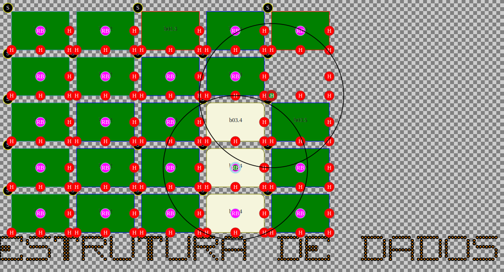

###This is the second part of the assignment.

Obs: this assignment was made with a [partner](https://github.com/wellintonpiassa).

Obs: the commits history can be found on [another reposity](https://github.com/wellintonpiassa/Estrutura-de-Dados) hosted by my partner.
