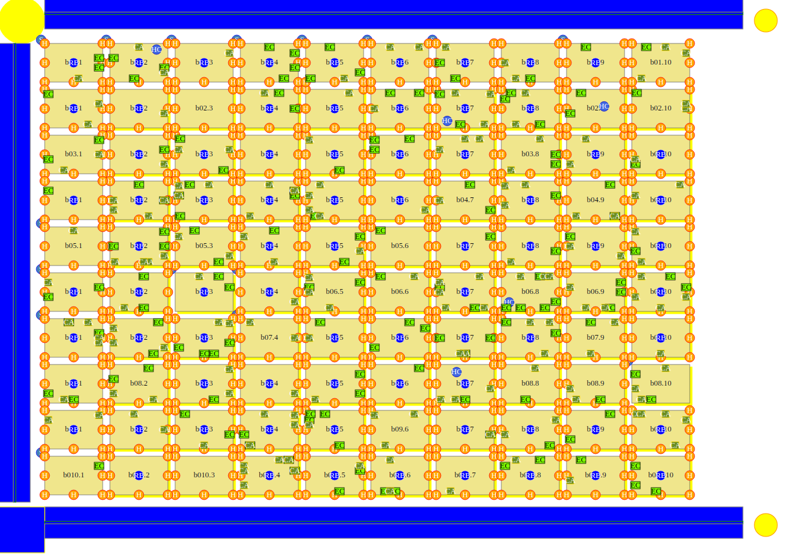

[![Contributors][contributors-shield]][contributors-url]
[![Forks][forks-shield]][forks-url]
[![Stargazers][stars-shield]][stars-url]
[![Issues][issues-shield]][issues-url]
[![MIT License][license-shield]][license-url]


<!-- PROJECT LOGO -->
<br />
<p align="center">
  <a href="https://github.com/VitorgsRuffo/Data-Structures-Assignment">
    
  </a>

  <h3 align="center">Data Structures Assignment</h3>

  <p align="center">
    This is a college assignment that aims to gradually implement a simplified geographic information system (GIS). It is divided into five parts and each one is built upon the previous one.
    <br />
  </p>
</p>


<!-- TABLE OF CONTENTS -->
<details open="open">
  <summary>Table of Contents</summary>
  <ol>
    <li>
      <a href="#about-the-project">About The Project</a>
    </li>
    <li>
      <a href="#getting-started">Getting Started</a>
      <ul>
        <li><a href="#prerequisites">Prerequisites</a></li>
        <li><a href="#installation">Installation</a></li>
      </ul>
    </li>
    <li><a href="#usage">Usage</a></li>
    <li><a href="#contributing">Contributing</a></li>
    <li><a href="#license">License</a></li>
    <li><a href="#contact">Contact</a></li>
  </ol>
</details>


<!-- ABOUT THE PROJECT -->
## About The Project



This is a college assignment that aims to gradually implement a simplified geographic information system (GIS) using the C programming language. A geographic information system (GIS) is a computer system for capturing, storing, checking, and displaying data related to positions on Earth’s surface. GIS can show many different kinds of data on one map. This enables people to more easily see, analyze, and understand patterns and relationships [(NatGeo)](https://www.nationalgeographic.org/encyclopedia/geographic-information-system-gis/). The assignment is divided into five parts and each one is built upon the previous one.

The first part's main goal is to build the foundations of the GIS, that is, the system's basic dynamics. Basically, the first assignment program takes some paths and file names as parameters and combines them. The program uses those parameters to build a path from which it can read input files. It also builds another path in which it can store files containing output information. A geo input file holds spatial data related to a fictitious city that must be stored for later processing. That data spans many different city elements like blocks, houses, streets, establishments, hydrants, semaphores, health centers, etc. The query input files hold instructions for performing operations on data read from geo files. Those operations include elements overlap checking, shortest path finding, deleting elements within a specific region, etc. The program, after storing geo files information and performing query operations on them, creates output files that show the result of those operations. More specifically, the output files are [svg files](https://www.w3schools.com/graphics/svg_intro.asp). When outputting information the program writes svg tags to a file in order to show the results visually. Initially, geo input information is stored on 3-dimensional arrays. 

The other assignment parts gradually introduce new city elements data for our program to process, along with new query operations to be performed on them. Those new data sometimes come in different input files, so our program has to take additional parameters and build new paths to read those files. Throughout the assignments it was used different data structures, implementing some abstract data types, in order to store the city elements data. Those structures include lists, stacks, queues, priority queues, pquad trees, graphs, hashtables, etc. For more information, check the assignments description (only in pt-br) under their respective folder.

<!-- GETTING STARTED -->
## Getting Started

Now, let's see how you can get a local copy of this project and run it.

### Prerequisites
The programs were made to run on linux distributions. It is a necessary to have gcc compiler and make installed.

* Installing gcc and make
  ```sh
   sudo apt update
   sudo apt install build-essential
  ```

### Installation 

1. Clone the repo:
   ```sh
   git clone https://github.com/VitorgsRuffo/Data-Structures-Assignment.git
   ```
2. Go to the repo's root directory and choose the assingment part to be runned, for example:
   ```sh
   cd ./A3/vitorgsr-wellintonp/src
   ```
3. Compile the program:
   ```sh
   make
   ```

<!-- USAGE EXAMPLES -->
## Usage

Use this space to show useful examples of how a project can be used. Additional screenshots, code examples and demos work well in this space. You may also link to more resources...


<!-- CONTRIBUTING -->
## Contributing

Contributions are what make the open source community such an amazing place to be learn, inspire, and create. Any contributions you make are **greatly appreciated**.

1. Fork the Project
2. Create your Feature Branch (`git checkout -b feature/AmazingFeature`)
3. Commit your Changes (`git commit -m 'Add some AmazingFeature'`)
4. Push to the Branch (`git push origin feature/AmazingFeature`)
5. Open a Pull Request


<!-- LICENSE -->
## License

Distributed under the GPL-3.0 License. See `LICENSE` for more information.


<!-- CONTACT -->
## Contact

Vitor G. S. Ruffo - [LinkedIn](https://www.linkedin.com/in/vitor-ruffo-8211731b6/) - vitor.gs.ruffo@gmail.com

Wellinton Piassa - [LinkedIn](https://www.linkedin.com/in/wellinton-piassa-56a44b195/) - wellintonpiassa@hotmail.com


<!-- MARKDOWN LINKS & IMAGES -->
<!-- https://www.markdownguide.org/basic-syntax/#reference-style-links -->
[contributors-shield]: https://img.shields.io/github/contributors/othneildrew/Best-README-Template.svg?style=for-the-badge
[contributors-url]: https://github.com/VitorgsRuffo/Data-Structures-Assignment/graphs/contributors
[forks-shield]: https://img.shields.io/github/forks/othneildrew/Best-README-Template.svg?style=for-the-badge
[forks-url]: https://github.com/VitorgsRuffo/Data-Structures-Assignment/network/members
[stars-shield]: https://img.shields.io/github/stars/othneildrew/Best-README-Template.svg?style=for-the-badge
[stars-url]: https://github.com/VitorgsRuffo/Data-Structures-Assignment/stargazers
[issues-shield]: https://img.shields.io/github/issues/othneildrew/Best-README-Template.svg?style=for-the-badge
[issues-url]: https://github.com/VitorgsRuffo/Data-Structures-Assignment/issues
[license-shield]: https://img.shields.io/github/license/othneildrew/Best-README-Template.svg?style=for-the-badge
[license-url]: https://github.com/VitorgsRuffo/Data-Structures-Assignment/LICENSE.txt
[linkedin-shield]: https://img.shields.io/badge/-LinkedIn-black.svg?style=for-the-badge&logo=linkedin&colorB=555
[product-screenshot]: images/city.png
